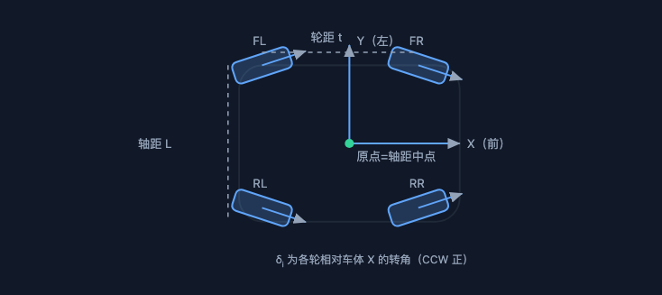
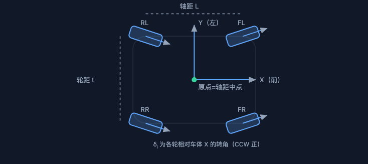
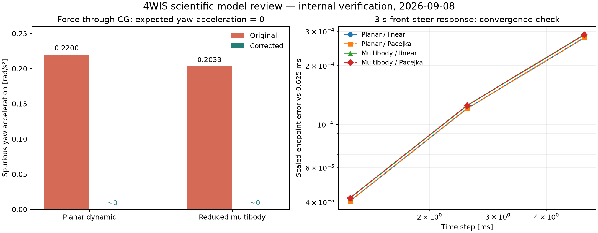

# 4WIS Simulator 科学模型评审与第一轮优化

日期：2026-09-08。基线：`bf0c1873914350e27b80b2e623e97a8aece13dd4`，v0.103.0，初始工作树 clean。工作分支：`codex/astra-dynamics-review`。

**结论：确认了多处会改变计算结论的物理与数值错误，已完成针对性修正和局部重构。现有功能回归通过；整车预测精度、实车选型与安全结论仍为 PENDING。** 这一轮是模型内部验证和软件优化，不构成实测相关性标定或发布验收。

## 1. 范围、方法和信任边界

从模型源代码、控制律、测试、参数、实验流程和浏览器真实界面交叉检查。先跑原有测试，再用独立的力矩平衡、虚功、非线性平衡点、重置重放和解析几何构造反例，随后修复。原有基线 **913 个后端测试、37 个前端测试均通过**，仍未捕获本轮发现的关键错误。

新增 `test_physics_review.py` 最初 39 个案例在原始代码快照上有 35 项失败、4 项通过；其中包含新增控制行为和接口契约，**不能解释为 35 个独立缺陷**。独立复审又增加两个退化机构案例，在修正可达性判据前均失败。原理图与几何显示另有三个前端测试。

历史 worktree 中曾处理的 RWS 刚度、驾驶曲率限速和 HUD 合速度问题，在当前 main 基线中仍存在，本轮已按当前代码重新核实与修正。历史修复记录不视为已经合并的证据。

ASTRA 负责机械推导、风险路由、跨层修改与最终验收。窄范围 BodyFrame 图的轮位修正通过 EVO Coder 完成，收据为 `CODER_DONE_PENDING_REVIEW`；独立审查发现尺寸方向和原点位置仍需处理，随后由 Planner 完成。未提交、推送、部署或重新发布便携包。

## 2. 已确认的问题与处理

| 优先级 | 问题 | 后果 | 本轮处理与独立证据 |
|---|---|---|---|
| P1 | 轴距中点 O 的速度套用质心 G 的牛顿欧拉方程 | 偏心载荷产生错误横摆，改变稳态/瞬态响应 | 集中 O→G 变换；通过质心的合力不再产生横摆加速度；稳态 bicycle 的力矩也改绕 G |
| P1 | RK4 子步内修改载荷/诊断状态 | 同一状态的 RHS 不唯一，积分结果受调用顺序影响 | 纯 RHS；准静态载荷每步接受后只更新一次；扰动增量不反馈叠加到自身 |
| P1 | 轮速隐式项使用线性 Cκ，而实际力来自非线性轮胎 | 即使驱动转矩等于实际轮胎阻转矩，轮速仍漂移 | 后向欧拉直接求解实际 Fx；正/反转、零速、饱和与平衡点残差测试 |
| P1 | Fy 力臂中误加横向 scrub，Fx 的左右镜像符号遗漏 | 主销负载、左右 torque-steer 与选型数值错误 | 接地点叉积校核；Fy 只乘机械拖距，Fx 使用 ±scrub，气胎拖距只经 −Mz 一次 |
| P1 | 齿条力把几何投影当成效率损失 | 不满足虚功，齿条/电机力链失真 | 由硬点隐式微分求 ds/dδ；有限差分验证 F·ds=τ·dδ；电机效率只计一次 |
| P1 | 重置未清除制动滤波、松弛、K&C 和诊断缓存 | 同样输入在重置后得到不同响应 | 动力学/多体 reset 与新建实例逐步重放一致；运动学恢复正确静态轴荷 |
| P1 | 轮胎离地载荷独立截零可增大总支持力；零附着仍有极小虚假力 | 凭空增加可用附着，离地边界不可靠 | 载荷转移受可用轴荷约束、保持 ΣFz=mg；μ=0/Fz=0 时严格零接触力 |
| P1 | RWS 参考忽略前后轴刚度比例 | 控制器设计依据与受控车辆不一致 | 默认 Cf=192000、Cr=288000 N/rad；审计研究脚本，消除比例二次相乘 |
| P2 | 满舵直接配合公路速度目标，零半径旋转率也从 v_max 推导 | 驾驶指令要求不可实现的向心加速度或极高旋转率 | 普通驾驶统一缩放车体速度/横摆以保持 ICR；显式实验速度绕过辅助；原地旋转默认上限 30°/s，可调整 |
| P2 | 停车时用 atan2(0,0) 求轮角；RWS 等角分支速度定义不连续 | 不踩油门不能正常打方向，跨分支时速度目标突变 | 零速从有限 ICR 或平移朝向求角；保持纵向速度定义连续 |
| P2 | 原理图轮位与 X/Y 轴矛盾，轴距/轮距反标；车速表只读 vx | FL/FR/RL/RR 概念与界面混乱，蟹行显示低估地速 | 修正轮位、尺寸、原点及主销/单轨示意；HUD 与顶部均使用 hypot(vx,vy)，轮角带明确轮名 |
| P2 | 更宽后轴在理想 4WIS 满舵时被单独截角；前桥显示半径的半轮距符号错误 | 四轮 ICR 不再共点，显示转弯半径错误 | 曲率能力取较宽车轴；由外轮角回算后轴中心半径，再变换到 O 的轨迹半径 |
| P2 | 简化模型把绝对道路高度当悬架压缩 | 在相同形状路面只改变海拔就改变 bump-steer | 去除支撑平面的平移/倾斜后仅保留非平面残差；同路面抬高 10 m 的回归 |

运行时状态数组的约定仍为 **FL / FR / RL / RR**。本轮明确复现的轮名反置位于原理页示意图；没有把所有画布中的视觉问题都归因于后端索引。

修正前后原理图：

| 原始图 | 修正后 |
|---|---|
|  |  |

## 3. 关键物理推导与边界

### 3.1 保留公开原点，同时正确使用质心方程

令 O 为轴距中点，G 在车体系 `(e,0)`，`e=L/2−a`，`a=cg_to_front`。公开速度为 O 的 `(u,v)`：

```
v_G = (u, v + e r)
M_G = M_O − e Fy
r_dot = M_G / Iz
u_dot = Fx/m + r v + e r²
v_dot = Fy/m − r u − e r_dot
ax_G = u_dot − r v − e r²
ay_G = v_dot + r u + e r_dot
```

MathWorks 的 [Vehicle Body 3DOF 官方说明](https://www.mathworks.com/help/vdynblks/ref/vehiclebody3dof.html)以质心为车体参考原点。本项目使用不同轴向约定与 O 原点，上式按本项目坐标独立推导，不能直接搬入另一软件的正负号。多体中的垂向静态配重按整车 CG 求解；簧载 CG 与 O 不重合时，heave/pitch 质量耦合也同时处理。

验证选 `a=1.0 m`，让轮胎接口输出与静态垂载成比例的已知侧向力，合力恰好通过 G。旧版简化动力学误报 **0.2200056 rad/s²**、多体误报 **0.2033155 rad/s²**；修正后均约 **−3.0×10⁻¹⁷ rad/s²**。横向加速度保持预期 **0.981 m/s²**。这是力矩平衡反例，不依赖任何实车轮胎标定。

### 3.2 主销与齿条

将接地点相对主销地面交点写成 `r_contact=(-t_m, σs)`，`σ=+1` 左轮、`−1` 右轮，则保持力矩：

```
τ_KP = −(r_contact × F)_z − Mz + τ_KPI
     = Fy t_m + σ Fx s − Mz + Fz sin(KPI) s sinδ
```

末项是低阶 KPI 近似，不能冒充完整空间主销轴投影或已经过台架标定的公式。主销偏置、机械拖距、气胎拖距是不同物理量。

理想机构虚功 `τ dδ=F_rack ds`，所以 `|F_rack|=|τ/(ds/dδ)|`，`T_motor=F_rack*r_p/(i*η_m)`。保留原 API 中各轮统一的“正转角努力方向”符号；它不是共同物理坐标中的左右齿条推拉符号。兼容字段 `geometry_efficiency` 只作为几何状态提示，不再充当传动力比。

默认硬点的局部齿条 ±85 mm 对应角度约 **+40.1° / −33.7°**，并非对称覆盖 ±35°。扫描与选型已标记不可达/奇异区间。`size_corner_actuator` 改为四轮、双向、71 个角度点扫描；默认电机的数值余量不能消除几何无效，因此整体内部筛查不通过。没有擅自扩大默认硬件行程来隐藏该问题。

### 3.3 数值积分与环境

车身/悬架保留 RK4 子步，轮速使用实际非线性后向欧拉，采用摩擦力上界构造根区间并保护 Newton 迭代。位姿采用恒定车体速度的 SE(2) 增量；动态模型以步首/步末平均速度构造增量。

**整个系统仍是一阶分步耦合方法。** 载荷、轮速、K&C 和控制器按离散时序更新，不能因局部使用 RK4 就声称整体四阶。末状态输出的轮胎力不等于 RK4 子步平均力。完整力/冲量一致的单体求解器留待接触与高频需求明确后评估。

简化模型支撑力饱和保持重量守恒，不意味着它能预测翻滚或腾空。道路仍以有限点采样与低阶纵坡重力表示，横坡重力、三维法向载荷与有限接地印迹尚未完整建模。`ax/ay` 是质心惯性加速度的车体系分量，在平地与平面比力一致；坡道上的完整 IMU 预测还需重力投影。

## 4. 独立算例与数值证据



右图工况：初速度 10 m/s、0.2 s 后前轮指令 0.06 rad、3 s 总时长，关闭风阻/滚阻/静态定位角/气动升力以隔离被测问题，采用 torque 模式零驱动。两种整车模型 × 两种轮胎，各用 5/2.5/1.25/0.625 ms。归一化终点误差定义为 `norm(([vx,vy,r]−reference)/[10,1,0.1])`，参考为 0.625 ms 结果，不能视作真解。

- 四组案例的误差随步长缩小而下降；5 ms 对比 0.625 ms 的末态横摆角速度差异均小于 **0.014%**。这只覆盖所列平顺、小转角工况，不是所有速度、轮胎、路面参数下的误差上界。
- 对称参数下左右转弯的末态镜像误差为零至数值精度。
- 无阻力直线滑行 1 s，速度误差为零，位置误差约 7×10⁻¹⁵ m；偏置质心多体仍保持静平衡。
- 实际 Pacejka 平衡点与后向欧拉转矩残差另由单元测试覆盖，包括反向、零速及超附着转矩。

数据：[修正前](astra_physics_before_2026-09-08.json)、[修正后](astra_physics_after_2026-09-08.json)。复现：[review_physics.py](../../scripts/review_physics.py)。本机 arm64，每模型/轮胎 1200 步的 95 分位耗时为 **0.16–0.25 ms**，对照默认 5 ms 单步预算；这不是浏览器、网络、操作系统调度或硬实时保证。见[运行耗时记录](astra_runtime_2026-09-08.json)。

## 5. 黄金实验迁移

先跑旧基线检查、记录偏差，在质心平衡、实际非线性转矩、虚功和步长对照通过后才更新。**全部 tolerance 配置逐项比较完全一致，未放宽阈值。** 三个单轮故障快速样本的内部分类仍为 C3 / C2 / C2；不是实车安全等级认定。

| 工况 / 指标 | 基线 | 修正后 | 变化 |
|---|---:|---:|---:|
| 60 km/h 阶跃转向横摆峰值，°/s | 13.23085 | 13.04322 | −1.42% |
| 60 km/h 双移线齿条峰值，N | 2952.42 | 2187.37 | −25.91% |
| 双移线转向努力积分，N·m·s | 60.57373 | 47.43487 | −21.69% |
| 100 km/h 中心区力矩梯度，N·m/g | 11.19598 | 9.60249 | −14.23% |
| 中心区力矩迟滞，N·m | 0.47242 | 0.30195 | −36.08% |
| 100 km/h RL 锁定故障附加横摆峰值，°/s | 21.26682 | 20.57462 | −3.25% |

这些差异主要来自参考点、主销力臂和机构力比的修正及其车辆/转向闭环反馈，不是“车辆性能提高了 26%”。旧报告的工程数值不能直接继续使用。黄金数值只用于防回归，不能证明模型正确。

另外纠正了测试的边界条件：圆周与低 μ 比较必须明确是否测试驾驶辅助；单独测试轮胎时固定同一速度/转角。无助力前轮是否跟随，不能忽略主动后轮通过车辆响应反过来推动前轮齿条。中心区迟滞仍包含车辆相位滞后，某两个摩擦点的单调关系不足以将其升级为纯摩擦要求。

## 6. 功能与验收记录

| 验收 | 结果 | 证据 / 范围 |
|---|---|---|
| 后端全量 | PASS，955 项（含 41 项新增物理回归） | `PYTHONPATH=backend/src backend/.venv/bin/python -m pytest backend/tests -n 4 -q`；176.73 s |
| 前端单元 | PASS，40 项 | 含轮位/原点与转弯几何；`npm --prefix frontend test` |
| 前端类型与生产构建 | PASS | `npm --prefix frontend run type-check`、`npm --prefix frontend run build` |
| 浏览器生产 E2E | PASS，54 项 | 运行/试验/分析/车辆/场景/负载/原理，录制/回放/导出，故障配置，异常态与 3D 相机，42.1 s |
| Smoke | PASS，32/32 | 核心几何、模型、异步推流、项目、场景、坡道、插件构造、录制与回放等 |
| 黄金实验 | PASS，6/6 | 迁移后重新执行比较，无阈值放宽 |
| 解析参考 | PASS，2/2、15 个指标 | 几何解析圆周/阶跃，不能视为独立车辆验证 |
| 浏览器追加试用 | PASS | 真实键盘驾驶、模型切换、2D/3D、原理公式渲染、负载警告；无 pageerror、无 KaTeX error |
| 科学边界 | PENDING | 独立来源门禁明确失败，v1 readiness 仍为 NOT READY |

浏览器蟹行回读中，`vx≈45.54 m/s`、`vy≈31.89 m/s` 时仪表显示约 200 km/h，与合速度一致；旧 vx-only 口径约为 164 km/h。该工况用于查显示来源，运动学模型不校验真实车辆在该速度下是否可实现。

保留两个原有 WebSocket 弃用警告。Ruff 仅整理本轮已触及文件的导入/未使用项，并检查致命错误；数学变量命名等既有风格债未全库清洗，不能声称全库 lint clean。

验证命令、结果摘录和本轮文件 SHA-256 已保存到[验收清单](astra_verification_2026-09-08.json)。该清单记录当前未提交工作树，不是发行版本或签名认证。

## 7. 下一阶段建议与尚未验证的能力

1. **统一轮胎/停车口径。** 当前时域默认 linear，负载页使用简化 Pacejka；低速正则化不等于静摩擦/接地印迹扭转。先明确 rolling / parking 两种适用区间，补入接地印迹、静摩擦与驱动反向过零试验。Chrono [轮胎模型文档](https://api.chrono.projectchrono.org/wheeled_tire.html)对 handling、刚性与可变形接触的区分可作为设计参考。
2. **参数辨识优先于继续增加自由度。** 需要轮胎 Fy/α、Fx/κ、Mz/α 对 Fz/μ 的数据，CG 与惯量、前后刚度、K&C、主销空间硬点、齿条行程/力、转向执行器与电机热参数。目前默认值含工程估计，新增自由度本身不能保证更高精度。
3. **统一“运动学可达—机构行程—实际执行器”约束。** 本轮已显示不可达并拒绝相应选型通过；时域的理想独立轮角作动器仍不是完整齿条硬点约束解。既定 35° 轮角也不支持当前车身几何下的无擦滑原地转向。
4. **升级道路与垂向模型。** 支撑平面变换、路面法向/横坡、轮胎包络、接地/离地事件与重力需统一。当前 14 DOF 属小角降阶研究模型，不能承担翻滚、腾空和复杂地形验证。
5. **逐步减少高层重复。** 已提取刚体参考点、轮速求解和原理公式公共模块。下一步可引入不可变 `ForceEvaluation`（输入状态/输出力与参考点），统一动态/多体/负载页的力计算口径；保留各自适用范围，不把两套垂向模型硬拼成一个分支函数。
6. **外部相关性闭环。** 选定同一车辆、轮胎、控制与输入时序，导入独立工具或台架/实车结果，按速度稳定段、同步、滤波与误差指标比较。当前独立来源数量为 0；缺少这一步时不能把内部 PASS 提升为实车 PASS。

**暂不建议全面重写。** 当前首要问题是参考点、力链与数值契约，不是框架数量或代码语言。先用本轮建立的不变量和外部数据约束下一步重构，再决定是否需要完整空间多体/接触求解器。架构决策见 [ADR](../adr/ADR-2026-09-08-physics-reference-and-integrator.md)。

## 8. 交付与回滚

全部改动留在本分支未提交 diff；没有修改任何已有实车数据或历史 run 来匹配新模型。旧手册、研究 HTML、已发布便携包保持历史版本，README 与可信度矩阵已标明跨版本边界。

复现当前科学验证：

```bash
PYTHONPATH=backend/src backend/.venv/bin/python -m pytest backend/tests/test_physics_review.py -q
backend/.venv/bin/python scripts/review_physics.py --output /tmp/4wis-physics-review.json
backend/.venv/bin/python scripts/check_golden_experiments.py
backend/.venv/bin/python scripts/check_reference_benchmarks.py --require-independent-source
```

最后一条在没有新独立数据时应失败，是正确的边界提示。回滚应审阅本轮文件 diff 逐项撤销；不需要 reset、stash 或删除用户数据。
